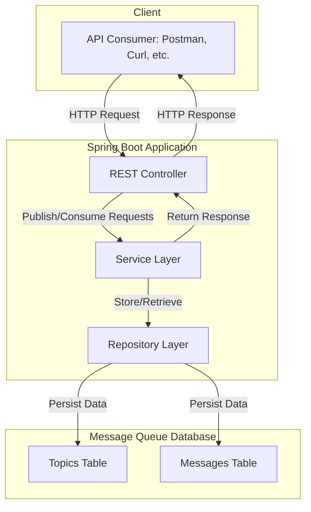

```mermaid
graph TD;
    subgraph Client
        C1[API Consumer: Postman, Curl, etc.]
    end

    subgraph Server[Spring Boot Application]
        S1[REST Controller]
        S2[Service Layer]
        S3[Repository Layer]
    end

    subgraph Database[Message Queue Database]
        D1[Topics Table]
        D2[Messages Table]
    end

    C1 -->|HTTP Request| S1
    S1 -->|Publish/Consume Requests| S2
    S2 -->|Store/Retrieve| S3
    S3 -->|Persist Data| D1
    S3 -->|Persist Data| D2
    S2 -->|Return Response| S1
    S1 -->|HTTP Response| C1
```