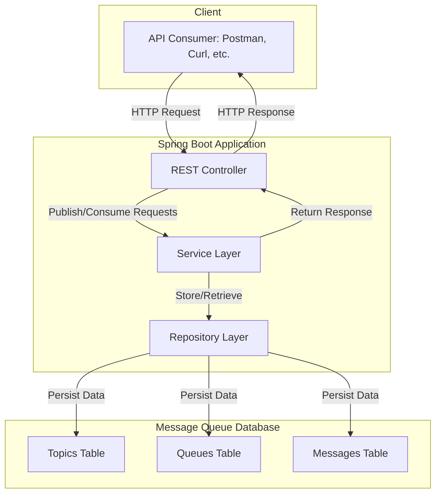
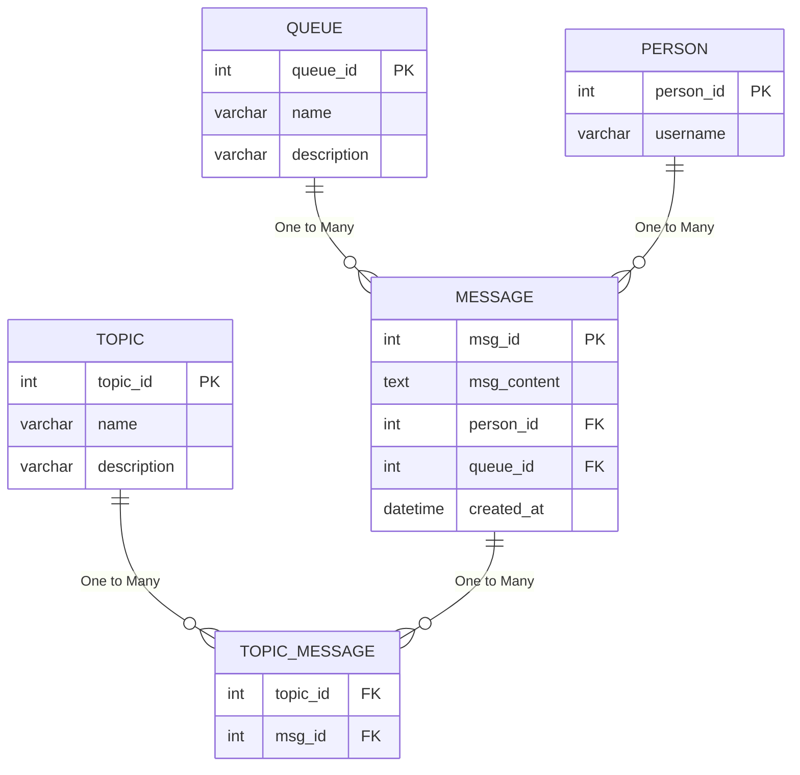

## Swagger UI
- http://localhost:8080/swagger-ui/index.html

## Application Architecture Overview



## Database Design


```
- Séance du 03/01
- JSON acyclic
- Cascade (Persistance)
- Queries
- Queues : impossible de supprimer un message non lu
- Gestion des Topics
- Relation N-N avec Message
- Numérotation interne des messages dans un topic
- GET : récupération d'une liste de massage à partir d'un numéro donnée
- Recherche de message par contenu partiel
- Suppression d'un message d'un Topic :  suppression du message uniquement si plus dans aucun Topic
```