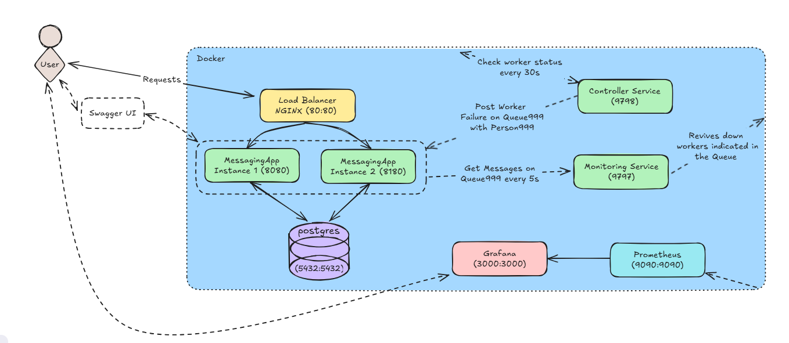

# Messaging System - Software Architecture Project

## Introduction
This project was developed as part of our **Software Architecture** course, focusing on the foundational concepts of **web development architecture**. The main objective was to design and implement a **messaging system** using **Java Spring Boot**, progressively integrating architectural principles learned throughout the course. The project emphasizes **RESTful APIs**, **database management** with **Spring Boot**, and **Docker** for containerization. It also incorporates **monitoring** and **fault tolerance** mechanisms to ensure system reliability and performance.

### **Contributors:**  
- Tristan Patout  
- Noé Florence  
- Ismail El Amrani  

### **Repository:**  
[GitHub - Software Architecture](https://github.com/NoeFBou/Software_Architecture)

---

## **Project Overview**
Our project is a **containerized messaging system** that allows the management of **messages, queues, and topics** with integrated monitoring, statistics, and fault tolerance mechanisms. The architecture incorporates multiple microservices and external tools for logging, monitoring, and automated recovery.

### **Key Concepts Implemented:**
- **REST API Implementation** using `@RestController`
- **JSON Acyclic Dependencies** for data integrity
- **JPA Cascade Persistence** for efficient database operations
- **Query Optimization & Data Retrieval** techniques

---

## **System Architecture**
### **Main Components:**
- **Database:** PostgreSQL instance managed via Docker, storing messages, users (persons), queues, and topics.
- **Messaging Applications (app1 & app2):** Handles message creation, processing, and retrieval.
- **Monitoring Application:** Periodically checks if worker applications (`app1`, `app2`) are running and sends failure alerts if needed on Queue 999.
- **Controller Application:** Listens for failure alerts from the monitoring service and attempts to restart failed instances.
- **Nginx:** Used for load balancing.
- **Prometheus & Grafana:** Collects and visualizes container metrics in real-time.
- **Swagger:** Provides interactive API documentation for testing and exploring the API endpoints.
---

## **Core Features Implemented**
### **1. Queues & Topics Management**
- Messages **cannot be deleted if unread**.
- If a message is read and not linked to a topic, **it is deleted**.
- Topics handle **many-to-many** relationships with messages.
- **GET requests:** Retrieve messages from queues & topics with optional filters.
- **POST requests:** Create messages in a queue or topic.
- **DELETE requests:** Messages are deleted if:
  - They are no longer associated with any topic.
  - If associated with a queue, they must have been read first.

---

## **Database Schema & Service Layer**
- **Database Schema:**

- **Implemented a service layer** to properly handle business logic and API requests.
- **Spring Data JPA** used for persistence and database interactions with:
  - **Repositories** for CRUD operations on messages, queues, and topics.
  - **Custom queries** for optimized data retrieval.

- Added **message metadata**, including:
  - **Time created**
  - **Time first accessed**
  - **Number of reads**

- **Logging & Statistical Tracking**
  - Tracks message access & read counts.
  - Exposes statistics through `/api/stats` endpoints.

---

## **Dockerization & Deployment**
- **Containerized** the application using Docker.
- Deployed **two instances** of the messaging app.
- Connected instances to a **Dockerized database**.
- Conducted experiments on the **Docker network**, including:
  - Listing active containers.
  - Monitoring application health via the Docker API (docker stats & docker ps & other commands).
- **Docker Compose** used for orchestrating our multi-container application.
- **Dockerfile** images for each app service
- **Nginx** used as a reverse proxy and load balancer for the two messaging applications.

---

## **Monitoring & Fault Tolerance**
- Developed a **MonitoringApplication** springBoot microservice:
  - Runs **every 30 seconds** to check if worker instances are running.
  - If a worker failure is detected, it **sends a notification to Queue 999** with Person 999.
- Developed a **ControllerApplication** microservice:
  - **Polls Queue 999 every 5 seconds** for failure alerts.
  - Attempts to restart the failed instance using **Docker commands**.

---

## **Statistics & Metrics Tracking**
- Implemented an **API route** (`/api/stats`) to retrieve key statistics:
  - **Messages:** Total count, access stats, associated topics & queues.
  - **Persons:** Total count, average access count, individual stats.
  - **Queues:** Total count, access stats.
  - **Topics:** Total count, access stats.
- This feature provides **lightweight system monitoring** without relying on full logging systems.

### **Statistics API Endpoints:**
| Endpoint | Description |
|----------|-------------|
| `GET /api/stats/messages` | Retrieves statistics on messages |
| `GET /api/stats/persons` | Retrieves statistics on users |
| `GET /api/stats/queues` | Retrieves statistics on queues |
| `GET /api/stats/topics` | Retrieves statistics on topics |

---

## **Docker Analysis & Real-Time Monitoring**
- Integrated **Grafana & Prometheus** for real-time monitoring & visualization.
- **Grafana Dashboards** allow tracking of system performance metrics.
- **Prometheus scrapes metrics** from exposed Java Spring endpoints.

---

## **Swagger API Documentation**
- Implemented **Swagger UI** for interactive API testing (`/swagger-ui/index.html`).

### **Why is Swagger Useful?**
- **Interactive API Documentation:** Developers can **explore & test** API endpoints easily.
- **Easier API Testing:** No need for **Postman or external tools**.
- **Automated Documentation:** Endpoints are auto-documented with `@Operation` & `@Tag` annotations.

### **Implementation Details:**
- **SpringDoc OpenAPI** dependency added.
- **Annotations for Documentation:**
  - `@Tag` → Categorizes controllers.
  - `@Operation` → Provides summaries & descriptions for each endpoint.
- **Swagger UI auto-generates** API documentation based on these annotations.

---

## **Final Architecture Schema**

## **Conclusion**
This project successfully **integrated core software architecture principles** into a **real-world messaging system**. Through **RESTful APIs, database management, monitoring, and fault tolerance**, we gained a valuable 1st experience in **system design and deployment** using SpringBoot. The use of **Docker, Prometheus, Grafana, and Swagger** further enhanced our ability to **scale and manage** the application efficiently.

---- Old README ----
## Swagger UI
- http://localhost:8080/swagger-ui/index.html

## Application Architecture Overview

